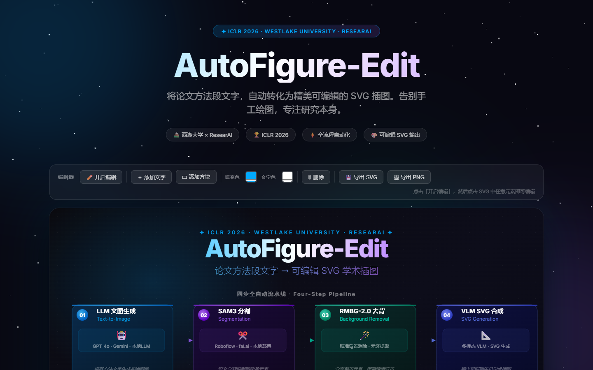

# WorkBuddy Skill — AutoFigure-Edit 网页内联编辑器

> **AutoFigure-Edit** × **WorkBuddy** — 将论文方法段文字一键转化为可编辑 SVG 插图，并支持功能完整的网页内联可视化编辑器（无需安装任何额外软件）。

[](LICENSE)
[](https://github.com/ResearAI/AutoFigure-Edit)
[](https://arxiv.org/abs/2603.06674)

[English](README_EN.md) | 中文

---

## 预览



---

## 功能特性

### 🤖 AI 图生成流水线
- **四步流水线**：论文方法段文字 → 图片生成 → SAM3 分割 → 背景去除 → SVG 组装
- **多 LLM 支持**：OpenRouter、边界AI（国内直连）、Google Gemini、本地 Ollama
- **多 SAM3 后端**：Roboflow、fal.ai、本地部署

### 🎨 网页内联编辑器（draw.io 风格）

直接打开 [`assets/editor-demo.html`](assets/editor-demo.html) 即可体验，**零依赖、无需服务器**。

#### 基础编辑
| 功能 | 说明 |
|------|------|
| ✏️ 编辑模式 | 工具栏「开启编辑」进入交互状态 |
| 🖱️ 拖拽移动 | 拖拽任意元素，自动换算 SVG viewBox 坐标系 |
| ⬛ 缩放手柄 | 选中后显示 8 方向控制点，精确调整尺寸（Visio 风格） |
| 🎨 颜色填充 | 工具栏拾色器一键修改填充色 |
| 📝 属性弹窗 | 单击元素弹出编辑面板：文字/字号/颜色/圆角/描边/透明度 |
| ＋ 添加元素 | 插入矩形、文字、圆形、箭头（line）、风格化图标 |

#### 多选 & 对齐
| 功能 | 说明 |
|------|------|
| 🔲 多选 | Ctrl+单击追加选中；拖拽空白区域橡皮筋框选 |
| ⬜ 组合 | Ctrl+G，将多选元素打包为 `<g>` 组，支持整体移动 |
| ⬛ 解组 | Ctrl+Shift+G，解散组合，偏移量自动叠加到子元素 |
| 📐 智能辅助线 | 拖拽时黄色磁吸参考线，8px 阈值自动对齐边缘/中心 |
| ◀▶▲▼ 对齐工具栏 | 6 种对齐（左/横中/右/顶/纵中/底）+ 2 种均匀分布 |
| Tab | 循环选择下一个元素（draw.io 风格） |

#### 连接线（Visio 核心）
| 功能 | 说明 |
|------|------|
| 🔗 连接线工具 | 点击「连接线」，依次点击源→目标，自动绘制带箭头连接线 |
| 🔵 端点拖动 | 选中连接线后显示蓝色端点手柄，可重新绑定源/目标元素（60px 磁吸） |
| 🔄 动态跟随 | 拖移元素时，连接线自动重算端点 |
| ✏️ 编辑属性 | 弹窗修改颜色、线宽、线型（实线/虚线/点线） |

#### 图标面板
| 功能 | 说明 |
|------|------|
| ⬡ 18 种图标 | CPU / DB / Cloud / Code / Brain / Lightning / Eye / Lock 等科技风格图标 |
| 一键插入 | 点击工具栏「⬡ 图标」弹出 6×3 网格面板，点击即插入 |
| 完整编辑 | 支持颜色、尺寸、透明度修改，可参与对齐/图层/撤回 |

#### 画布缩放 & 平移
| 功能 | 快捷键 |
|------|--------|
| 滚轮缩放（以鼠标位置为中心） | 鼠标滚轮 |
| 步进缩放（预设级别 10%~800%） | Ctrl+`-` / Ctrl+`=` |
| 复位 100% | Ctrl+`0` |
| 适合画布 | 工具栏「适合」/ 底部 HUD |
| 空格+拖拽平移 | 空格键 + 鼠标拖拽 |
| 触屏双指捏合缩放 | 触控屏手势 |

#### 撤销 / 重做（历史系统）
- **Ctrl+Z / Ctrl+Y**，最多 **60 步**历史
- 覆盖所有操作类型：移动、缩放、样式、新增、删除、组合/解组、图层顺序、锁定、连接线

#### 图层面板 & 右键菜单
| 功能 | 说明 |
|------|------|
| 图层面板 | F7 或工具栏打开右侧抽屉，列出所有元素，支持点选/可见性/锁定 |
| 右键菜单 | 选择/编辑/图层顺序/组合/解组/删除 |
| 重叠选择器 | 右键→「此处的元素」，解决多层堆叠点选问题 |
| 属性条 | 选中后顶部显示元素类型/x/y/w/h/uid 信息栏 |

#### Z-Order 图层控制
| 快捷键 | 功能 |
|--------|------|
| `]` | 上移一层 |
| `Ctrl+]` | 置顶 |
| `[` | 下移一层 |
| `Ctrl+[` | 置底 |

#### 完整键盘快捷键

| 快捷键 | 功能 |
|--------|------|
| `Ctrl+Z` | 撤销 |
| `Ctrl+Y` | 重做 |
| `Ctrl+S` | 导出 SVG |
| `Ctrl+C` | 复制 |
| `Ctrl+V` | 粘贴（+20 单位偏移） |
| `Ctrl+D` | 就地复制 |
| `Ctrl+A` | 全选 |
| `Ctrl+G` | 组合选中元素 |
| `Ctrl+Shift+G` | 解组 |
| `Ctrl+\-` | 缩小 |
| `Ctrl+=` | 放大 |
| `Ctrl+0` | 缩放复位 100% |
| `Delete` | 删除选中元素 |
| `Esc` | 取消选中 |
| `↑ ↓ ← →` | 微调位移（1 单位） |
| `Shift+方向键` | 大步微调（10 单位） |
| `Tab` | 循环选择下一元素 |
| `G` | 切换网格显示 |
| `L` | 锁定/解锁元素 |
| `F7` | 打开/关闭图层面板 |

---

## 目录结构

```
workbuddy-autofigure-edit-skill/
├── SKILL.md                  # WorkBuddy Skill 主文件
├── scripts/
│   ├── setup_env.py          # 环境配置助手
│   ├── run_autofigure.py     # CLI 运行封装
│   ├── launch_editor.py      # 网页内联编辑器启动脚本
│   └── check_update.py       # GitHub 更新检查
├── references/
│   ├── providers.md          # LLM 提供商配置详解
│   ├── sam3-backends.md      # SAM3 后端配置详解
│   ├── local-llm.md          # 本地大模型配置
│   ├── inline-editor.md      # 网页内联编辑器完整文档
│   └── changelog.md          # 变更日志
└── assets/
    ├── editor-demo.html      # 内联编辑器演示页（直接浏览器打开即可）
    ├── preview_banner.png
    └── preview_fullpage.png
```

---

## 快速安装

### 在 WorkBuddy 中安装此 Skill

1. 下载或克隆本仓库：
   ```bash
   git clone https://github.com/Flipped929/workbuddy-autofigure-edit-skill.git
   ```

2. 将文件夹复制到 WorkBuddy Skills 目录：
   - **Windows**：`%USERPROFILE%\.workbuddy\skills\autofigure-edit\`
   - **macOS/Linux**：`~/.workbuddy/skills/autofigure-edit/`

3. 在 WorkBuddy 对话中输入触发词，例如：
   - `使用 AutoFigure-Edit 生成论文插图`
   - `打开内联编辑器编辑 SVG`
   - `检查 AutoFigure-Edit 是否有新版本`

---

## 使用示例

### 生成论文插图（CLI）

```bash
python scripts/run_autofigure.py \
  --project-dir /path/to/AutoFigure-Edit-main \
  --method-file paper.txt
```

### 配置环境（交互式）

```bash
python scripts/setup_env.py --project-dir /path/to/AutoFigure-Edit-main
```

### 启动网页内联编辑器

```bash
# 打开已生成的 SVG 进行可视化编辑
python scripts/launch_editor.py --svg /path/to/final.svg

# 生成独立 HTML（可离线使用、分发）
python scripts/launch_editor.py --svg /path/to/final.svg --standalone
```

### 在线演示编辑器

直接用浏览器打开 `assets/editor-demo.html`，无需服务器，即可体验完整编辑功能。

---

## 上游项目

本 Skill 为 [AutoFigure-Edit](https://github.com/ResearAI/AutoFigure-Edit)（西湖大学 / ResearAI，ICLR 2026）的 WorkBuddy 集成封装。

- **上游仓库**：https://github.com/ResearAI/AutoFigure-Edit
- **论文**：https://arxiv.org/abs/2603.06674
- **许可证**：Apache 2.0（同上游项目）

---

## License

Apache License 2.0 — 详见 [LICENSE](LICENSE)
